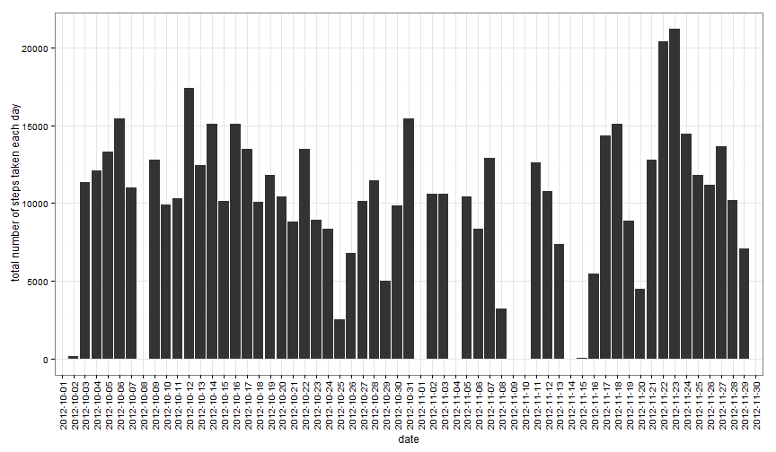
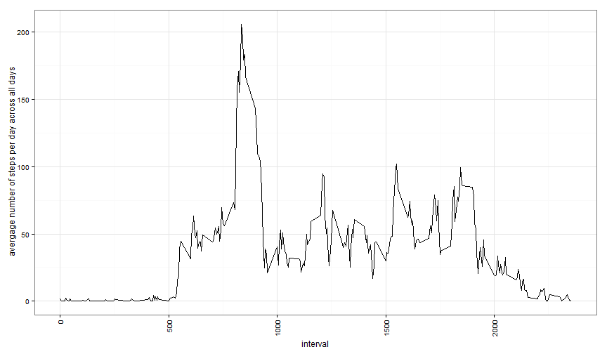
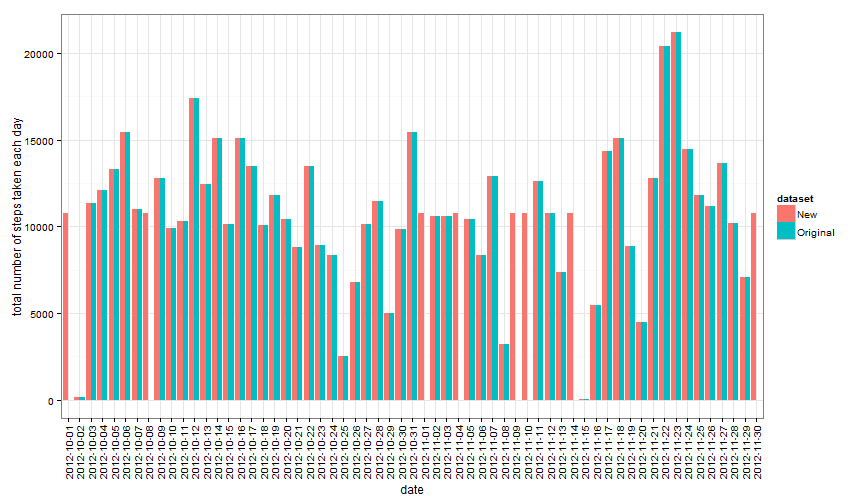
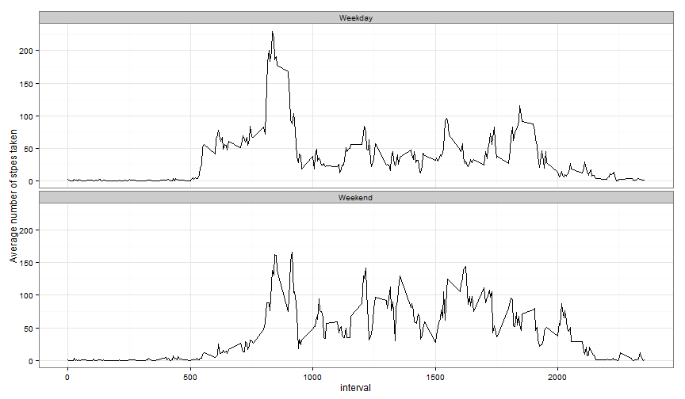

## Introduction
It is now possible to collect a large amount of data about personal movement using activity monitoring devices such as a Fitbit, Nike Fuelband, or Jawbone Up. These type of devices are part of the "quantified self" movement -- a group of enthusiasts who take measurements about themselves regularly to improve their health, to find patterns in their behavior, or because they are tech geeks. But these data remain under-utilized both because the raw data are hard to obtain and there is a lack of statistical methods and software for processing and interpreting the data.

This assignment makes use of data from a personal activity monitoring device. This device collects data at 5 minute intervals through out the day. The data consists of two months of data from an anonymous individual collected during the months of October and November, 2012 and include the number of steps taken in 5 minute intervals each day.


## Loading Data
Data for this assignement should be located in the same directory where RMardown file is. The below R code unzips data and loads it into R.

```r
library(dplyr)
library(ggplot2)

unzip("repdata-data-activity.zip")
Activity <- read.csv("activity.csv")
```

## What is mean total number of steps taken per day?
Create a histogram of the total number of steps taken each day.

```r
#t1 contains sum of number of steps per day
t1 <- Activity %>% group_by(date) %>% summarise(NumOfSteps=sum(steps,na.rm=TRUE))

#f1 is a histogram
f1 <- ggplot(t1, aes(x = factor(date), y = NumOfSteps)) + theme_bw() + geom_bar(stat="identity") 
f1 <- f1 + theme(axis.text.x = element_text(angle = 90, vjust = 0.5, hjust=1)) 
f1 <- f1 + ylab(" total number of steps taken each day") + xlab("date")
f1
```

 

Calculate the mean and median total number of steps taken per day.

```r
cat("Mean: ",toString(t1 %>% summarise(MeanOfTotalNumOfStepsPerDay = mean(NumOfSteps))))
```

```
## Mean:  9354.22950819672
```

```r
cat("Median: ",toString(t1 %>% summarise(MedianOfTotalNumOfStepsPerDay = median(NumOfSteps))))
```

```
## Median:  10395
```

## What is the average daily activity pattern?
Create a time series plot (i.e. type = "l") of the 5-minute interval (x-axis) and the average number of steps taken, averaged across all days (y-axis).

```r
#t2 contains avg number of steps per interval
t2 <- Activity %>% group_by(interval) %>% summarise(AvgNumOfSteps=mean(steps,na.rm=TRUE))

f2 <- ggplot(t2, aes(interval,AvgNumOfSteps)) + theme_bw() + geom_line() 
f2 <- f2 + theme(axis.text.x = element_text(angle = 90, vjust = 0.5, hjust=1)) 
f2 <- f2 + ylab(" avergage number of steps per day across all days") + xlab("interval")
f2
```

 

Find the 5-minute interval that, on average across all the days in the dataset, contains the maximum number of steps. 

```r
interval_with_highest_avg <- max(t2$AvgNumOfSteps)
cat('Interval with the highest average: ',toString((t2 %>% filter(AvgNumOfSteps==interval_with_highest_avg))[1]))
```

```
## Interval with the highest average:  835
```

## Inputing missing values
Find the number of missing values in the steps field:

```r
cat('Number of missing values: ',toString((Activity %>% filter(is.na(steps)) %>% summarise(MissingValues=n()))))
```

```
## Number of missing values:  2304
```

Populate missing values using average number of steps per interval across all days, example: interval 1255 for 2012-11-09 will have "steps" field populated with a number that is equal to average number of steps for interval 1255 across all days. Store the New data set, with missing values populated, under Activity2 data.frame. The variable "steps"" holds original value whereas "steps_cleaned" holds the new values (no NAs).

```r
Activity2 <- Activity %>% filter(is.na(steps)) 
Activity2 <- left_join(Activity2,t2)
```

```
## Joining by: "interval"
```

```r
Activity2 <- select(Activity2, -steps)
Activity2 <- left_join(Activity,Activity2)
```

```
## Joining by: c("date", "interval")
```

```r
Activity2 <- Activity2 %>% mutate(steps_cleaned = ifelse(is.na(steps),AvgNumOfSteps,steps))
Activity2 <- select(Activity2,date,interval,steps_cleaned,steps) 
```

Calculated the mean and median total number of steps taken per day of the New data set and compare it to the mean and median of the Original data set. Note that the mean and median of the New data set are equal!

```r
t3 <- Activity2 %>% group_by(date) %>% summarise(NumOfSteps=sum(steps,na.rm=TRUE),NumOfStepsCleaned=sum(steps_cleaned))

cat('Original data set mean: ', toString(t3 %>% summarise(Original_MeanOfTotalNumOfStepsPerDay = mean(NumOfSteps))))
```

```
## Original data set mean:  9354.22950819672
```

```r
cat('Original data set median: ', toString(t3 %>% summarise(Original_MedianOfTotalNumOfStepsPerDay = median(NumOfSteps))))
```

```
## Original data set median:  10395
```

```r
cat('New data set mean: ', toString(t3 %>% summarise(NAsPopulated_MeanOfTotalNumOfStepsPerDay = mean(NumOfStepsCleaned))))
```

```
## New data set mean:  10766.1886792453
```

```r
cat('New data set median: ', toString(t3 %>% summarise(NAsPopulated_MedianOfTotalNumOfStepsPerDay = median(NumOfStepsCleaned))))
```

```
## New data set median:  10766.1886792453
```

The below histogram compares the total number of steps taken each day using the New data set and Original data set (for comparison purpose). Note that if there is an Original data set bar then the New data set bar associated with that date will have the same height. Moreover, populating missing values introduced new bars for dates which do not have Original data set bar. This is very interesting results which are driven by the method used to populate missing values.

```r
t3 <- with(t3,
        data.frame(
            date = rep(date, 2),
            dataset = factor(rep(c("Original","New"), each = NROW(t3))),
            value = c(NumOfSteps,NumOfStepsCleaned)    
        )
    )

f3 <- ggplot(t3, aes(date, value)) + geom_bar(aes(fill = dataset), position = "dodge", stat="identity")+ theme_bw() 
f3 <- f3 + theme(axis.text.x = element_text(angle = 90, vjust = 0.5, hjust=1)) 
f3 <- f3 + ylab("total number of steps taken each day") + xlab("date") 
f3
```

 

## Are there differences in activity patterns between weekdays and weekends?
Create the plot containing a time series plot of the 5-minute interval (x-axis) and the average number of steps taken, averaged across all weekday days or weekend days (y-axis). The plot was created using New data set. It shows the difference in activity patterns between weekdays and weekends. 

```r
#add new variable: IsWeekday
Activity2 <- Activity2 %>% mutate(IsWeekday = ifelse(weekdays(as.Date(date))=="Saturday" | weekdays(as.Date(date))=="Sunday","Weekend","Weekday"))

#prepare data.frame that will be used in the chart f4
t4 <- Activity2 %>% group_by(interval,IsWeekday) %>% summarise(AvgNumOfSteps=mean(steps_cleaned,na.rm=TRUE))

f4 <- qplot(interval,AvgNumOfSteps, data=t4, geom=c("line")) + 
    theme_bw() + 
    facet_wrap(~IsWeekday,nrow=2)  + 
    ylab("Average number of stpes taken")
f4
```

 
